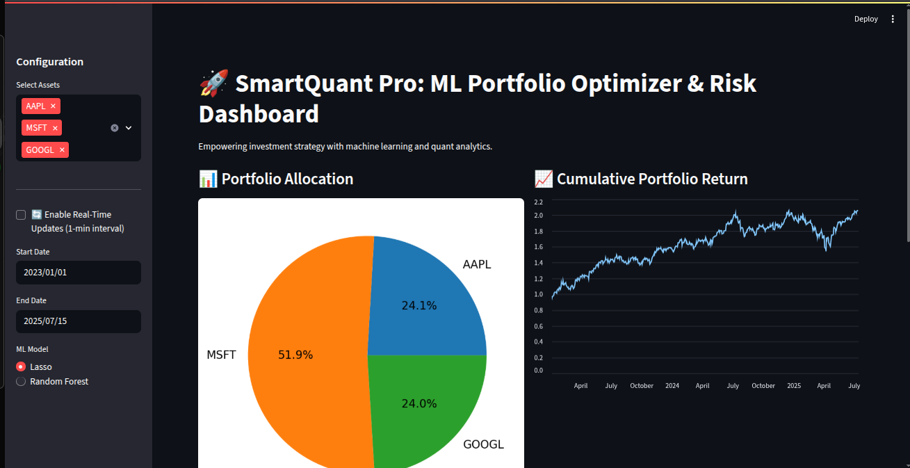

# SmartQuant-PortfolioOptimizer


**Machine learning–driven portfolio optimization and risk analytics, in an interactive Streamlit dashboard.**

SmartQuant Pro pulls live and historical market data, forecasts short-term asset returns with configurable ML models, solves a mean-variance portfolio optimization problem, and surfaces the resulting allocation alongside standard risk metrics — all in one screen.



---

## Features

**Return forecasting**
- Lasso Regression
- Random Forest Regressor
- Models are trained per-asset on rolling technical features (1-day return, 5-day volatility, 5-day momentum, SMA(5)–SMA(10) spread) and used to predict next-period return

**Portfolio optimization**
- Minimum-variance optimization via `cvxpy`, subject to a target return constraint (predicted portfolio return ≥ mean of predicted asset returns), full investment (weights sum to 1), and a long-only constraint (no short selling)

**Risk analytics**
- Value at Risk (95%)
- Conditional VaR / Expected Shortfall (95%)
- Maximum Drawdown
- Rolling 20-day volatility

**Visualization**
- Portfolio allocation pie chart
- Cumulative portfolio return chart
- Rolling volatility chart

**Data & interactivity**
- Historical daily price data via `yfinance`, with a configurable date range
- Optional real-time mode (1-minute interval, last trading day) with a manual refresh button
- Sidebar controls for asset universe, ML model choice, date range, and refresh mode
- Cached data loading (60s TTL) to avoid redundant API calls

---

## Tech Stack

| Component        | Library / Tool                  |
|-------------------|----------------------------------|
| Frontend          | `Streamlit`                     |
| Market Data       | `yfinance`                       |
| ML Models         | `scikit-learn` (Lasso, Random Forest) |
| Portfolio Optimization | `cvxpy`                     |
| Numerical Computing | `NumPy`, `pandas`               |
| Visualization     | `matplotlib`, Streamlit native charts |

---

## Getting Started

### Prerequisites
- Python 3.9+
- pip

### Installation
```bash
git clone https://github.com/your-username/SmartQuantPro.git
cd SmartQuantPro
pip install -r requirements.txt
```

### Run the app
```bash
streamlit run smartquant_app.py
```

The dashboard will open in your browser at `http://localhost:8501`.

---

## Usage

1. **Select assets** — Choose one or more tickers from the sidebar (e.g. AAPL, MSFT, GOOGL).
2. **Choose a data mode** — Pick a historical date range, or enable real-time mode for 1-minute intraday data with a manual refresh.
3. **Pick a model** — Switch between Lasso and Random Forest to compare how forecasted returns and the resulting allocation change.
4. **Review the output** — The dashboard computes optimal weights, then displays allocation, cumulative return, and risk metrics (VaR, CVaR, Max Drawdown, rolling volatility).

---

## How It Works

1. **Data loading** — Historical or intraday close prices are pulled for the selected tickers via `yfinance` and cached for 60 seconds.
2. **Feature engineering** — For each asset, rolling return, volatility, momentum, and SMA-difference features are computed, with next-period return as the training target.
3. **Return forecasting** — A Lasso or Random Forest model is trained per asset and used to predict expected return over the most recent window.
4. **Optimization** — `cvxpy` solves a minimum-variance quadratic program over the asset covariance matrix, subject to a target-return and long-only, fully-invested constraint.
5. **Reporting** — The resulting weights drive the allocation chart, portfolio return series, and downstream risk metrics.

---

## Project Structure

```
SmartQuantPro/
├── smartquant_app.py       # Main Streamlit application
├── requirements.txt        # Python dependencies
├── screenshots/            # Dashboard images/GIFs for this README
└── README.md
```

---

## Roadmap

- [ ] Sharpe ratio–maximizing objective as an alternative to minimum variance
- [ ] Support for short positions and leverage constraints
- [ ] Backtesting module with configurable rebalancing frequency
- [ ] Additional risk metrics (Sortino ratio, beta vs. benchmark)
- [ ] Model performance diagnostics (feature importance, out-of-sample error)

---

## Disclaimer

This project is for educational and research purposes only. It does not constitute financial advice, and predicted returns/allocations should not be used for live trading decisions without independent due diligence.

---

## License

[MIT](LICENSE)
